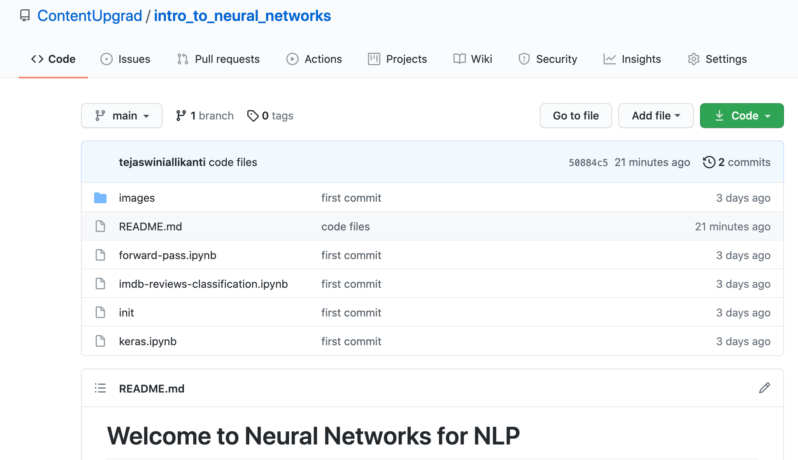
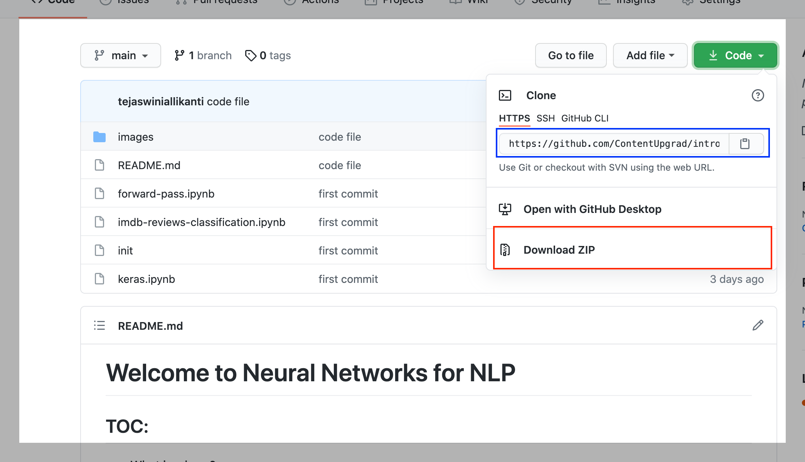

# Welcome to Neural Networks for NLP

## TOC:
- What is where?
- FAQs

### What is where?
The folder structure is given below:

As you can see there are three main code files when you log in:

1. **forward-pass.ipynb** This is the code file for session 1: Understanding Neural Networks
2. **keras.ipynb** This is where all the code files for session 3: Understanding Tensorflow are kept
3. **imdb-reviews-classification.ipynb** This is the code file for session 4: Case Study: IMDB Movie review classification

The datasets required are linked in the code files itself. Please follow the steps that are shown in the video demonstration to install the data files.
OR 
You can download the data files from [here](https://drive.google.com/drive/u/0/folders/1hYw0TQbwcM2YWEiKN-2c_kHCPtHO_TMC)

### FAQs
How do i download all the files in github?

Click on Code button and then click on Download ZIP
OR
Use `git clone https://github.com/ContentUpgrad/intro_to_neural_networks.git` command on your terminal if git is installed in your machine. 
