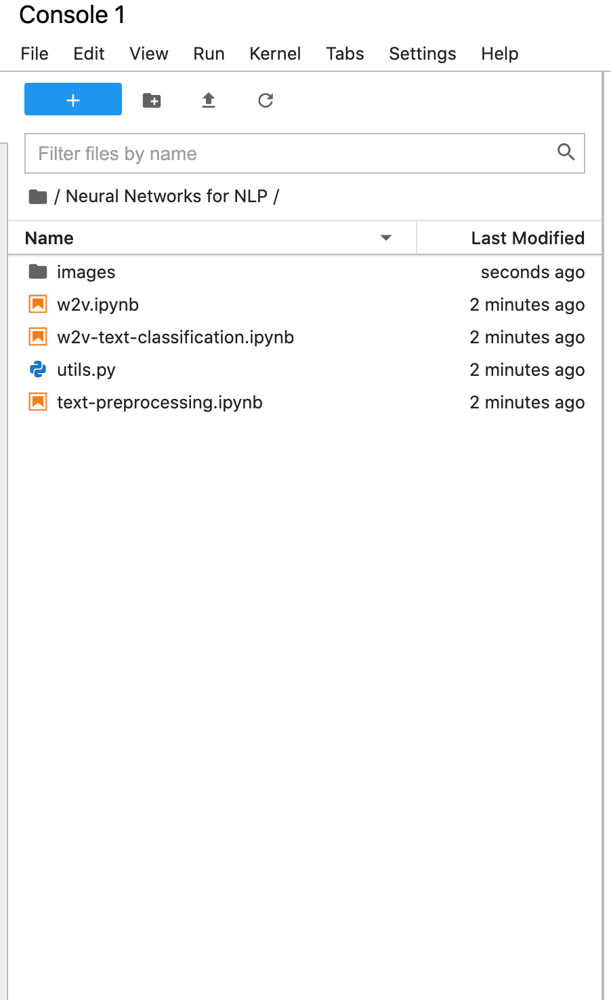

# Welcome to Neural Networks for NLP

## TOC:
- What is where?
- Common gotchas to avoid?

### What is where?
The folder structure is given below:

As you can see there are three main code files when you log in:

1. **forward-pass.ipynb** This is the code file for session 1: Understanding Neural Networks
2. **keras.ipynb** This is where all the code files for session 3: Understanding Tensorflow are kept
3. **imdb-reviews-classification.ipynb** This is the code file for session 4 : Case Study: IMDB Movie review classification

The datasets required are linked in the code files itself. Please follow the steps that are shown in the video demonstration to install the data files

As you can see the folder structure is loosely based on the deep learning course on Upgrad Platform. You will be working with the `.ipynb files.`

 ### Common gotchas to avoid

1. **Always shut down the notebooks when you are done with your work**

2. **Don't run two notebooks (if using tensorflow) simultaneously**
   
Tensorflow has the tendency to use all the gpu memory. If you are running one notebook in which you are training a tensorflow model, trying to run another notebook and training a tensorflow model will give you an error.

3. **Don't install too many python libraries in the main environment**
 
 Commonly used libraries that you will need to run the codes and submit assignment/case study are already installed. In case you need to install many new libraries, make use of the terminal and create a separate virtual environment and install the libraries in that venv and use that venv. [Learn how to create virtual environments](https://packaging.python.org/guides/installing-using-pip-and-virtual-environments/)
